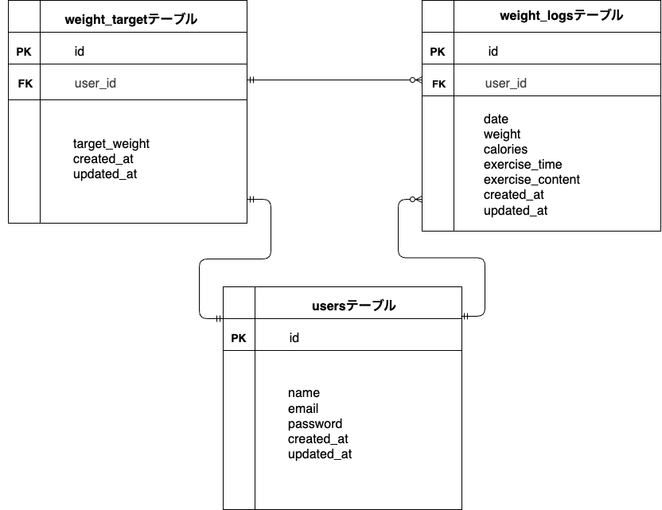

# Pigly(ピグリー)

## 環境構築・画像取り扱いについて

- 画像は `storage/app/public/images` に保存されています。
- 画像をブラウザからアクセスするために、php artisan migrate --seed を実行後、php artisan storage:link を実行してください。

### Docker ビルド

1. git clone https://github.com/morikoshi2627/pigly.git
2. cd pigly
3. docker-compose build
4. docker-compose up -d
5. docker-compose exec php bash

### Laravel 環境構築

1. composer install
2. cp .env.example .env
3. php artisan key:generate
4. .env の DB 設定を以下のように修正

   DB_CONNECTION=mysql  
   DB_HOST=mysql  
   DB_PORT=3306  
   DB_DATABASE=pigly_db  
   DB_USERNAME=pigly_user  
   DB_PASSWORD=pigly_pass

5. php artisan migrate --seed
6. php artisan storage:link.

### アプリ確認用 URL

- アプリ URL: http://localhost/weight_logs
- phpMyAdmin: http://localhost:8080/
  （ユーザー名: pigly_user、パスワード:pigly_pass）

### 使用技術（実行環境）

- Laravel 8.83.29
- PHP 7.4.9-fpm
- MySQL 8.0.26
- Docker / Docker Compose

### ER 図

### URL

- 開発環境：http://localhost/
- phpMyAdmin：http://localhost:8080/
